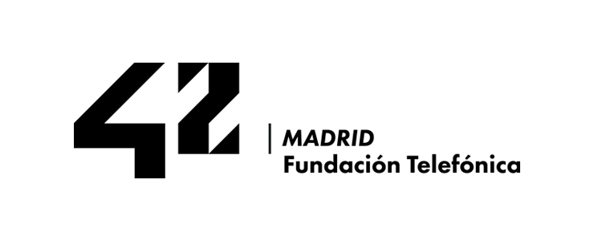

# 🚀 Project-43: Mi aventura (segunda vuelta) en 42 Madrid

Este repositorio no es mi primera toma de contacto con 42 Madrid.  
Ya había estado antes, pero este proyecto es **mi preparación previa al segundo intento**.  
Aquí recopilo todo mi bagaje antes de empezar oficialmente otra vez.  
En solo **11 días** he repasado lo que he podido, así que los bloques y ejercicios que hay son los que me ha dado tiempo a completar antes de volver a lanzarme.

En el futuro, iré añadiendo **explicaciones detalladas** y los **nuevos bloques** que vaya resolviendo allí.

---

## 📚 Contenido del repositorio

- 📂 **Shell00, Shell01**  
  - Ejercicios completos de scripting y manejo de shell.  
  - En casi todos los directorios de ejercicios hay un archivo `comandos` con:  
    - Los comandos que he usado para resolver el ejercicio.  
    - La solución final directamente lista para ejecutar.
- 📂 **C00, C01, C02** — Ejercicios en C desde lo básico hasta control de estructuras.  
- 📂 **C03 y C07 (parcial)** — Ejercicios intermedios que alcancé a repasar.  
- 📄 **Norminette y enunciados en PDF** — Documentación oficial para escribir código limpio y entender cada bloque.  
- 📝 **Simulacro de examen & prueba de nivel** — Entrenamiento bajo condiciones similares a las reales.  
- 🗃️ **Ficheros de prueba varios** — Para testing rápido y debugging.  
- ⚙️ **Configuración personalizada de Vim** — Mi entorno optimizado para ser más productivo.

---

## 🎯 Nota importante

Este repositorio **no es una guía paso a paso**.  
Es mi espacio personal de preparación y almacenamiento.  
A medida que avance en la piscina de 42, lo iré completando con **más bloques, explicaciones y mejoras**.

---

## ✉️  Contacto

Si quieres compartir ideas o comentar ejercicios, me puedes encontrar en 42 o por bzancio@gmail.com.

---

🔹 **Como dijo un sabio :No te fies de un**

